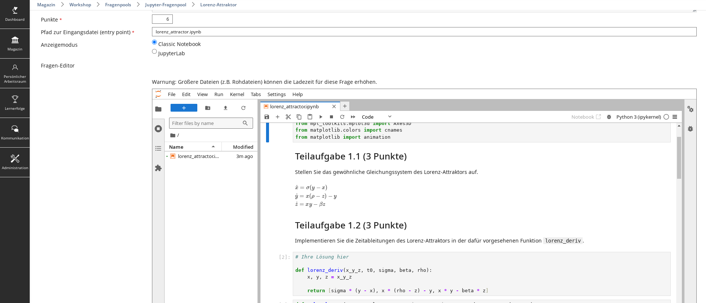

## Jupyter plugin for ILIAS

This plugin introduces a new question type which enables for testing and assessing Jupyter notebooks within the ILIAS platform.
It incorporates the communication to Jupyterhub and user servers executing kernels used in Jupyter Notebooks.
This plugin also uses the ILIAS internal data storage as a primary system to store all data from Jupyter projects, s.t. no data is left on Jupyterhub persistently.
Test and assessment features like scoring, feedbacks and hints are supported.

Note that Jupyterhub needs to be configured for plugin's normal operation.
To this end, refer to the project [Embedded Jupyterhub](https://github.com/TIK-NFL/jupyterhub/tree/embedded).



### Install

__Important__: This plugin sends requests to Jupyterhub URLs that do not match with the origin.
Thus, the URL of the ILIAS instance executing this plugin needs to be allowed at Jupyterhub's access control.

1. Access the installation root directory of your running ILIAS instance (e.g.,  `/var/www/ilias`) and clone the Jupyter plugin:
    ```
    git clone https://github.com/TIK-NFL/Jupyter.git ./Customizing/global/plugins/Modules/TestQuestionPool/Questions/assJupyter
    ```
2. Access ILIAS by a web browser and go to:  **Administration  →  Extending ILIAS  →  Plugins**.
3. Locate the Jupyter plugin and install it by clicking **Actions → Install**.
4. Finally, activate the Jupyter plugin by clicking **Actions → Activate**.

### Configuration
1. Access ILIAS and go to  **Administration  →  Extending ILIAS  →  Plugins**.
2. On the  assJupyter  entry, click:  **Actions  →  Configure**.
3. Refer to the following properties:
   |                       Property | Description                                                                                          | Example value                            |
   |-------------------------------:|------------------------------------------------------------------------------------------------------|------------------------------------------|
   |                      Log-Level | Webserver logging level                                                                              | DEBUG                                    |
   |          Jupyterhub server URL | URL to the Jupyterhub installation including the REST API server                                     | `https://jupyterhub.mydomain.tld:8000`   |
   |            Jupyterhub API path | Internal path to the API server                                                                      | `/hub/api`                               |
   |                      API token | API token for the REST server access                                                                 | `my-api-token`                           |
   |                      Proxy URL | URL to the local ILIAS webserver providing the ProxyPass (typically same as _Jupyterhub server URL_) | `https://jupyterhub.mydomain.tld:8000`   |
   | Default Jupyter Project (JSON) | JSON of the initial Jupyter project (keep as general as possible)                                    | (see below)                              |
   
   _Example of a default Jupyter project containing a plain notebook (JSON):_
   ```
   {
      "jupyter_project": [
        {
          "name": "main.ipynb",
          "path": "main.ipynb",
          "content": {
            "cells": [],
            "metadata": {
              "kernelspec": {
                "display_name": "Python 3 (ipykernel)",
                "language": "python",
                "name": "python3"
              }
            },
            "nbformat": 4,
            "nbformat_minor": 5
          },
          "format": "json",
          "type": "notebook"
        }
      ]
   }
   ```
4. **Save** and optionally **test** the configuration. Note that the configuration test requires changes to be saved before.

#### Integration (optional)
- Activate the manual scoring for Jupyter questions in **Administration → Repository and Objects → Test and Assessment**.